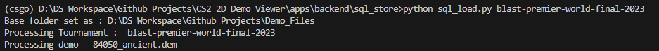

# CS2-2D-Demoviewer
A CS2 2D Demo viewer built with Pygame, supported by a SQL database in the backend to parse and store key events from processed demos , which can then be retrieved from the database. 
Through this, a set of 29 matches from Blast Premier World Final 2023 of 6 GB can be stored in a SQL database of 385 MB. (Around 16x reduction , can be optimized quite a bit further)

To keep things simple, the folder Demo_Files needs to be in the same parent directory containing this repo. 

When processing the demo (if it's pro matches - most likely from hltv), it is required to use ID for the demo as the file name - this is so that the Unique Matches can then be identified using this filename as 'MatchID'. The complete sql db can be viewed with the name "testdb.db" - inside backend\sql_store

Parent Directory
   |
   |- CS2 2D Demo Viewer\
   |- Demo_Files\
        |- Tournament Name \ 
                |- 000001.dem
                |- 000002.dem

The parser can be invoked by running the sql_load.py script in the backend folder from command prompt or terminal. It requires an argument - the tournament name which should be the same as the folder name. This name will be captured and stored in the SQL db as well. 

